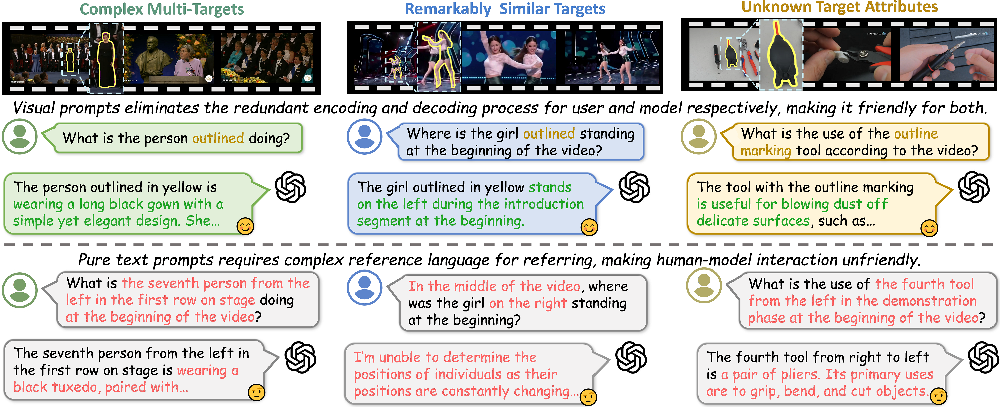
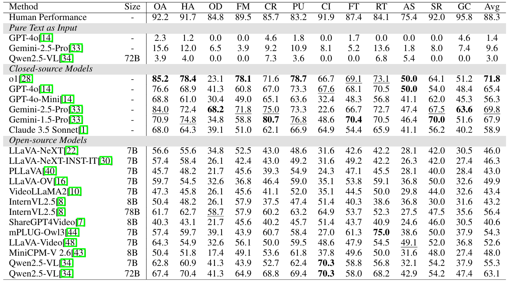

<!-- intro fig eval-pipeline 需要的文件-->

# V2P-Bench: Evaluating Video-Language Understanding with Visual Prompts for Better Human-Model Interaction

 
 
  


<font size=7><div align='center' > [[🌐 Homepage](https://vlm-reasoning.github.io/V2P-Bench/)] [[📖 arXiv Paper](https://arxiv.org/abs/2503.17736)] [[📊 Dataset](https://huggingface.co/datasets/gaotiexinqu/V2P-Bench)]  [[🏆 Leaderboard](https://vlm-reasoning.github.io/V2P-Bench/#leaderboard)]  </div></font>

---

## 🔥 News
* **[TBD]** 🔥 We have released a newer version of our paper on [Arxiv](https://arxiv.org/abs/2503.17736).

* **[2026/01/26]** 🔥 V2P-Bench has been accepted to `ICLR2026`!

* **[2025/03/23]** 🔥 We release the [V2P-Bench Dataset](https://huggingface.co/datasets/gaotiexinqu/V2P-Bench) on HuggingFace.

* **[2025/03/22]** 🔥 Paper is now available on [Arxiv](https://arxiv.org/abs/2503.17736).

* **[2025/03/20]** 🔥 We have released `V2P-Bench`, a comprehensive benchmark specifically designed to evaluate the video understanding capabilities of LVLMs in human-model interaction scenarios.

---

## 👀 Introduce V2P-Bench

<p align="center">
    
</p>

Large Vision-Language Models (LVLMs) have made significant strides in video understanding, excelling in tasks like video captioning and question answering. However, existing benchmarks primarily use text prompts, which often lack precise spatial and temporal references, complicating assessments in complex scenarios. **We introduce V2P-Bench**, a dedicated benchmark for **evaluating LVLMs' video understanding in human-model interactions.** V2P-Bench comprises 980 curated videos and 1,172 question-answer pairs, including 5 tasks, 12 categories, and 20 video types, utilizing various visual prompts to enhance spatial and temporal comprehension. V2P-Bench aims to provide a more intuitive and effective evaluation of LVLM capabilities. Our benchmark features:

- **Wide distribution of durations:** Videos are categorized into **short (< 3 minutes)**, **medium (3-30 minutes)**, and **long (30-120 minutes)** videos, with respective proportions of 46.8\%, 22.0\%, and 31.2\% to ensure diversity in temporal dimension.

- **Diverse video types and comprehensive tasks:**  Selecting from 12 video benchmarks, V2P-Bench consists of **5 main tasks** and **12 categories**, with **20 subfields** to enhance the generalizability across a wide range of scenarios.

- **Diverse Targets and Visual Prompts:** Featuring **a diverse array of target types and visual prompts**, benefiting from the extensive breadth of video sources and the rigor of purely manual annotations.

- **Comprehensive Shot Types:** Including both **continuous and transition videos**, the latter of which significantly increases the difficulty of reference, implying that the model must perform temporal and spatial grounding in different scenes.

- **Quality in annotations**. All data (question-answer pairs and visual prompt frames) are **annotated manually and undergo both model and human filtering** to ensure data quality.

<p align="center">
    
</p>

<p align="center">
    
</p>

## 🔮 Evaluation
📍 **Data Preparation**:

Download the data from [HuggingFace](https://huggingface.co/datasets/gaotiexinqu/V2P-Bench).
```
git lfs install
git clone https://huggingface.co/datasets/gaotiexinqu/V2P-Bench
```

Then organize the data as follows in eval.
```
V2P-Bench
├── videos
│   ├── ActivityNet
│   ├── EgoSchema
│   ├── LVBench
│   ├── MLVU
│   ├── MSRVTT-QA
│   ├── MSVD-QA
│   ├── MVBench
│   ├── NExTVideo
│   ├── Perception_Test
│   ├── TVBench
│   ├── VCGBench-Diverse
│   ├── Video-MME_xk
│   └── Video-MME_yk
├── frames
│   ├── ActivityNet
│   ├── EgoSchema
│   ├── LVBench
│   ├── MLVU
│   ├── MSRVTT-QA
│   ├── MSVD-QA
│   ├── MVBench
│   ├── NExTVideo
│   ├── Perception_Test
│   ├── TVBench
│   ├── VCGBench-Diverse
│   ├── Video-MME_xk
│   └── Video-MME_yk
└── dataset_info.jsonl
```


📍 **Inference and evaluation**:

We save model responses in a **JSONL** file. The response file for `Qwen2.5-VL-72B-Instruct` is provided. Please refer to the provided [inference code](./infer/infer_qwen2.5-vl.py) and [response file](./data/Qwen2.5-VL-72B-Instruct.jsonl)  to set up your model. 

Once getting model responses in this format, run eval.py to get accuracy scores across video durations and task types. The Q&A pairs are multiple-choice, using rules for matching, without third-party models.The question-and-answer pairs are in a multiple-choice format, using only rules for matching, without introducing any third-party models.

```
python infer_qwen2.5-vl.py \
        --model_path path/to/Qwen2.5-VL-72B-Instruct \
        --video_root path/to/V2P-Bench/videos \
        --image_root path/to/V2P-Bench/frames \
        --data_path path/to/dataset_info.jsonl \
        --output_path path/to/Qwen2.5-VL-72B-Instruct.jsonl \
        --model_id qwen2.5-vl-72b-instruct
```

```
python eval.py \
    --data_path path/to/Qwen2.5-VL-72B-Instruct.jsonl
```


## 📈 Main Results
- **Evaluation results across dimensions.**

<p align="center">
    
</p>

- **Hack Phenomena on V2P-Bench.**

<p align="center">
    
</p>

<p align="center">
    
</p>

## 📐 More Examples
<details>
<summary> Click to expand more examples.</summary>

<p align="center">
    
</p>


</details>


## 📜 Citation
If you find our work helpful for your research, please consider citing our work.
```
@article{zhao2025v2p,
  title={V2P-Bench: Evaluating Video-Language Understanding with Visual Prompts for Better Human-Model Interaction},
  author={Zhao, Yiming and Zeng, Yu and Qi, Yukun and Liu, YaoYang and Chen, Lin and Chen, Zehui and Bao, Xikun and Zhao, Jie and Zhao, Feng},
  journal={arXiv preprint arXiv:2503.17736},
  year={2025}
}
```

**License**:

```
V2P-Bench is under the CC-BY-NC 4.0 license, only used for academic research. We do not own the copyright of any raw video files. Dataset is prohibited for commercial use without permission. Please contact us at gaotiexinqu@mail.ustc.edu.cn if there is any questions.
```
